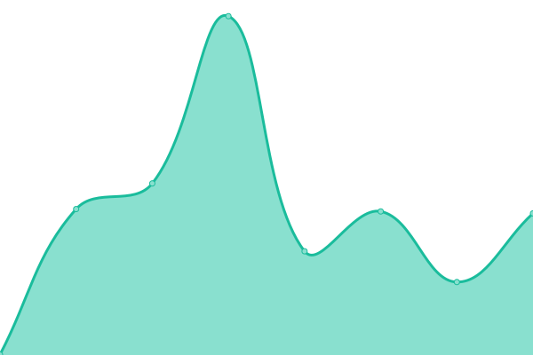

# [📈 Live Status](https://idrunk65.github.io/games): <!--live status--> **🟧 Partial outage**

This repository contains the open-source uptime monitor and status page for [iDrunK](https://idrunk65.github.io/games), powered by [Upptime](https://github.com/upptime/upptime).

With [Upptime](https://upptime.js.org), you can get your own unlimited and free uptime monitor and status page, powered entirely by a GitHub repository. We use [Issues](https://github.com/idrunk65/games/issues) as incident reports, [Actions](https://github.com/idrunk65/games/actions) as uptime monitors, and [Pages](https://idrunk65.github.io/games) for the status page.

<!--start: status pages-->
<!-- This summary is generated by Upptime (https://github.com/upptime/upptime) -->
<!-- Do not edit this manually, your changes will be overwritten -->
<!-- prettier-ignore -->
| URL | Status | History | Response Time | Uptime |
| --- | ------ | ------- | ------------- | ------ |
|  [Panel](https://games.idrunk.fr) | 🟩 Up | [panel.yml](https://github.com/iDrunK65/games/commits/HEAD/history/panel.yml) | 

 716ms
     
 | 

<a href="https://idrunk65.github.io/games/history/panel">100.00%</a>
    

|  [Game 01](https://game01.idrunk.fr) | 🟥 Down | [game-01.yml](https://github.com/iDrunK65/games/commits/HEAD/history/game-01.yml) | 

 0ms
     
 | 

<a href="https://idrunk65.github.io/games/history/game-01">3.01%</a>
    

|  [Game 02](https://game02.idrunk.fr) | 🟥 Down | [game-02.yml](https://github.com/iDrunK65/games/commits/HEAD/history/game-02.yml) | 

 0ms
     
 | 

<a href="https://idrunk65.github.io/games/history/game-02">63.30%</a>
    

|  [Game 03](https://game03.idrunk.fr) | 🟥 Down | [game-03.yml](https://github.com/iDrunK65/games/commits/HEAD/history/game-03.yml) | 

 0ms
     
 | 

<a href="https://idrunk65.github.io/games/history/game-03">3.27%</a>
    

|  [Game 04](https://game04.idrunk.fr) | 🟥 Down | [game-04.yml](https://github.com/iDrunK65/games/commits/HEAD/history/game-04.yml) | 

 0ms
     
 | 

<a href="https://idrunk65.github.io/games/history/game-04">7.28%</a>
    

<!--end: status pages-->

[**Visit our status website →**](https://idrunk65.github.io/games)

## 📄 License

- Powered by: [Upptime](https://github.com/upptime/upptime)
- Code: [MIT](./LICENSE) © [iDrunK](https://idrunk65.github.io/games)
- Data in the `./history` directory: [Open Database License](https://opendatacommons.org/licenses/odbl/1-0/)
