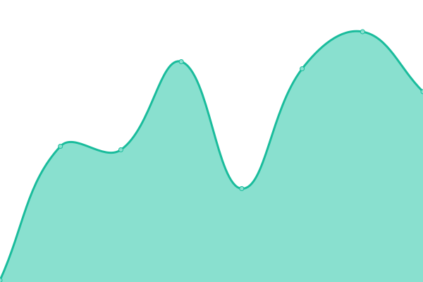

# [📈 Live Status](https://idrunk65.github.io/games): <!--live status--> **Tous les systèmes sont opérationnels**

This repository contains the open-source uptime monitor and status page for [iDrunK](https://idrunk65.github.io/games), powered by [Upptime](https://github.com/upptime/upptime).

With [Upptime](https://upptime.js.org), you can get your own unlimited and free uptime monitor and status page, powered entirely by a GitHub repository. We use [Issues](https://github.com/idrunk65/games/issues) as incident reports, [Actions](https://github.com/idrunk65/games/actions) as uptime monitors, and [Pages](https://idrunk65.github.io/games) for the status page.

<!--start: status pages-->
<!-- This summary is generated by Upptime (https://github.com/upptime/upptime) -->
<!-- Do not edit this manually, your changes will be overwritten -->
<!-- prettier-ignore -->
| URL | Status | History | Response Time | Uptime |
| --- | ------ | ------- | ------------- | ------ |
|  [Tsuki - Panel](https://panel.tsukihomura.fr) | En ligne | [tsuki-panel.yml](https://github.com/iDrunK65/games/commits/HEAD/history/tsuki-panel.yml) | 

 419ms
     
 | 

<a href="https://idrunk65.github.io/games/history/tsuki-panel">100.00%</a>
    

|  [Tsuki - Node 1](https://play.tsukihomura.fr:8080) | En ligne | [tsuki-node-1.yml](https://github.com/iDrunK65/games/commits/HEAD/history/tsuki-node-1.yml) | 

 363ms
     
 | 

<a href="https://idrunk65.github.io/games/history/tsuki-node-1">100.00%</a>
    

|  [BryanTM - Panel](https://bryan.idrunk.fr) | En ligne | [bryan-tm-panel.yml](https://github.com/iDrunK65/games/commits/HEAD/history/bryan-tm-panel.yml) | 

 594ms
     
 | 

<a href="https://idrunk65.github.io/games/history/bryan-tm-panel">100.00%</a>
    

|  [BryanTM - Node 1](https://game.bryan.idrunk.fr) | En ligne | [bryan-tm-node-1.yml](https://github.com/iDrunK65/games/commits/HEAD/history/bryan-tm-node-1.yml) | 

 492ms
     
 | 

<a href="https://idrunk65.github.io/games/history/bryan-tm-node-1">100.00%</a>
    

<!--end: status pages-->

[**Visit our status website →**](https://idrunk65.github.io/games)

## 📄 License

- Powered by: [Upptime](https://github.com/upptime/upptime)
- Code: [MIT](./LICENSE) © [iDrunK](https://idrunk65.github.io/games)
- Data in the `./history` directory: [Open Database License](https://opendatacommons.org/licenses/odbl/1-0/)
